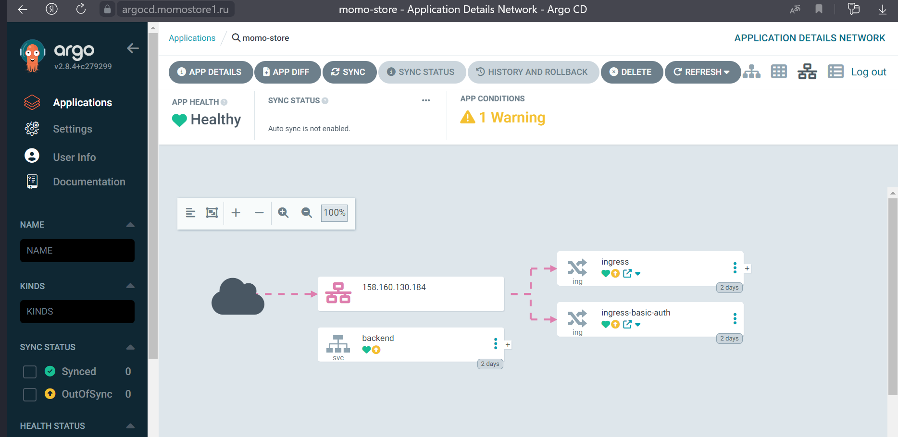
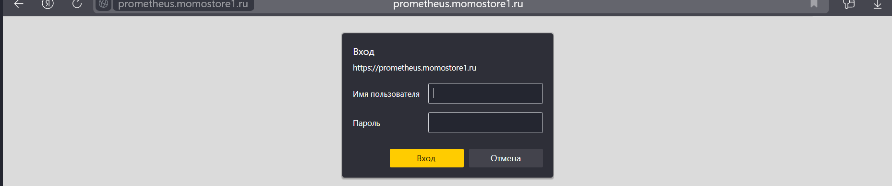
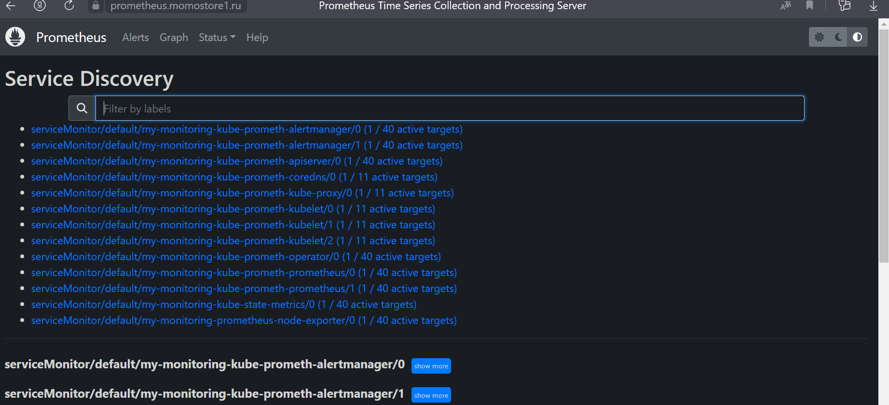
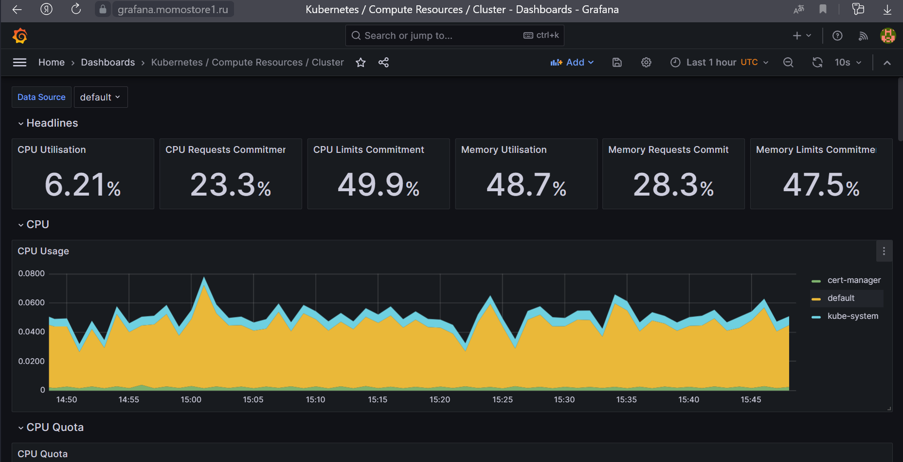
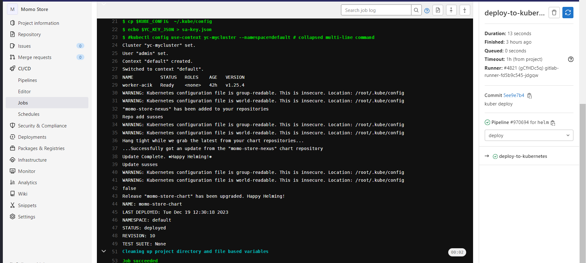
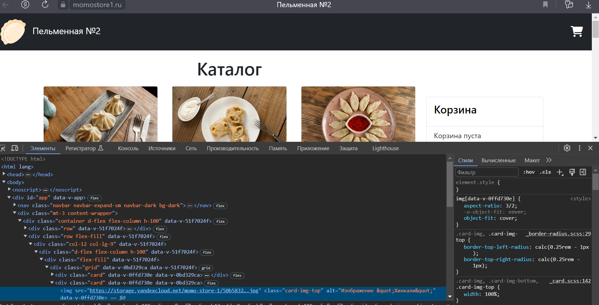

# Momo Store aka Пельменная №2


## Frontend

```bash
npm install
NODE_ENV=production VUE_APP_API_URL=http://localhost:8081 npm run serve
```

## Backend

```bash
go run ./cmd/api
go test -v ./... 
```


#build front
docker build . --build-arg  VUE_APP_API_URL=/api --no-cache -t frontend:0.0.1


Momo Store aka Пельменная №2

Локальный запуск компонентов

Frontend

npm install
NODE_ENV=production VUE_APP_API_URL=http://localhost:8081 npm run serve


Backend

go run ./cmd/api
go test -v ./... 

## Ресурсы на которых развернуто приложение и сервсисы

- https://momostore1.ru/
- https://argocd.momostore1.ru
- https://grafana.momostore1.ru
- https://prometheus.momostore1.ru
- https://alertmanager.momostore1.ru

## CI/CD

- используется единый [репозиторий](https://gitlab.praktikum-services.ru/std-019-032/momo-store/)
- развертывание приложение осуществляется с использованием [Downstream pipeline](https://docs.gitlab.com/ee/ci/pipelines/downstream_pipelines.html#parent-child-pipelines) 
- при изменениях в соответствующих директориях триггерятся pipeline для backend, frontend и momo-store-chart
- backend и frontend проходят этапы сборки, тестирования, релиза, деплоя в  prod окружении (k8s)
- momo-store-chart проходит этапы релиза и деплоя в prod-окружение (k8s)


## Infrastructure

- код ---> [Gitlab](https://gitlab.praktikum-services.ru/)
- helm-charts ---> [Nexus](https://nexus.praktikum-services.tech/)
- анализ кода ---> [SonarQube](https://sonarqube.praktikum-services.ru)
- docker-images ---> [Gitlab Container Registry](https://gitlab.praktikum-services.ru/std-019-032/momo-store/container_registry)
- терраформ бэкэнд и изображения  ---> [Yandex Object Storage](https://cloud.yandex.ru/services/storage)
- prod ---> [Yandex Managed Service for Kubernetes](https://cloud.yandex.ru/services/managed-kubernetes)

## Init kubernetes

- клонировать репозиторий на машину с установленным terraform
- через консоль Yandex Cloud создать сервисный аккаунт с ролью `editor`, получить статический ключ доступа, сохранить секретный ключ в файле `terraform_k8s/backend.tfvars`
- получить [iam-token](https://cloud.yandex.ru/docs/iam/operations/iam-token/create), сохранить в файле `terraform_k8s/terraform.tfvars`
- через консоль Yandex Cloud создать Object Storage, внести параметры подключения в файл `terraform_k8s/version.tf` и `terraform_k8s/terraform_backend.tf`
- выполнить следующие комманды:

```
cd terraform_k8s
terraform init -backend-config=terraform_backend.tfvars
terraform apply -var-file="terraform.tfvars"
```


## Init production
```
cd terraform_k8s/init_script
post_install.sh # получаем kube_config

install_cert-manager.sh # для получечения сертификата letsencrypt.org  на домены 
install_external_dns.sh  # для автоматического создания dns записей типа A для доментов описанных в ingress 
install_ingress.sh # установка nginx-ingress-controller
install_grafana_stack.sh # установка оператора по настройке сервисов сбора метрик, алертинга , визуализации  метрик
kubectl create secret generic basic-auth --from-file=auth  (требуется для создания basic auth авторизации для сервисов не использующих авторизацию по паролю,  prometheus/alertmanager)
kubectl apply -f admin_sa.yaml # создание пользователя с правами admin для доступа сторонних сервисов к кластеру
install_argoch.sh # установка GitOps-инструмента для непрерывной доставки (Continuous Delivery, CD) и развертывания приложений K8s
#получить пароль для пользователя admin 
kubectl --namespace default get secret argocd-initial-admin-secret \
  --output jsonpath="{.data.password}" | base64 -d
```


## Backlog

- добавить тестовое окружение (отдельный кластер или отдельный namespace)
- вывести мониторинг из чарта самого приложения (ускорить деплой)
- поднять Vault для хранения секретов

##Приложение.

### argocd

### basic-auth на примере prometheus


### grafana

### деплой helm chart через gitlab.ci

### хранение изображений в s3

